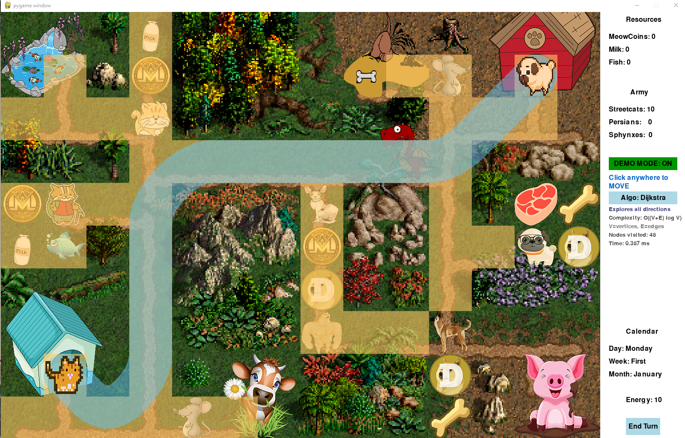

# PetWars 🐱⚔️🐶

A turn-based strategy game built with Pygame where cats battle against dogs for territorial supremacy!


## Overview

PetWars is a Heroes of Might and Magic-inspired strategy game featuring two rival factions: **Cats** and **Dogs**. Navigate your hero across a tile-based map, collect resources, recruit armies, and defeat your opponent!

### Features

- **Turn-based gameplay** with movement points per turn
- **Resource management** - Collect MeowCoins, Milk, and Fish
- **Army recruitment** - Build your forces with Street Cats, Persians, and Sphynxes
- **AI opponent** - Dog faction with autonomous pathfinding behavior
- **Multiple pathfinding algorithms** with visualization:
  - **Dijkstra's Algorithm** - Explores all directions uniformly
  - **A\* (A-Star)** - Heuristic-guided search for faster pathfinding
  - **Bellman-Ford** - Edge relaxation algorithm
- **Demo Mode** - Watch pathfinding algorithms visualize step-by-step
- **Production buildings** - Capture farms to generate passive income

## Screenshots


*Starting screen with the game map*


*Demo mode showing pathfinding algorithm visualization*

## Installation

### Prerequisites

- Python 3.8 or higher
- pip (Python package manager)

### Steps

1. **Clone the repository**
   ```bash
   git clone https://github.com/hristogwivanov/PetWars.git
   cd PetWars
   ```

2. **Install dependencies**
   ```bash
   pip install pygame
   ```

3. **Run the game**
   ```bash
   python main.py
   ```

## How to Play

### Controls

| Key/Action | Description |
|------------|-------------|
| **Arrow Keys** | Move hero one tile in that direction |
| **Mouse Click** | Click a tile to pathfind and move there |
| **D** | Toggle Demo Mode (algorithm visualization) |
| **E** | End Turn |
| **End Turn Button** | Click to end your turn |

### Gameplay

1. **Movement** - You have 10 energy points per turn (orthogonal: 2, diagonal: 3). Click on a tile to automatically find the shortest path and move there.
2. **Collect Resources** - Walk over resource tiles to collect MeowCoins, Milk, or Fish.
3. **Capture Buildings** - Visit production buildings (Milk Farm, Fish Pound) to gain passive resource income each turn.
4. **Fight Enemies** - Encounter neutral units on the map to battle them.
5. **Win Condition** - Reach the enemy Dog hero's position to win!

### Demo Mode

Press **D** or click the Demo Mode button to enable algorithm visualization:
- Watch the pathfinding algorithm explore the map in real-time
- **Orange tiles** = Visited nodes
- **Yellow tiles** = Frontier (nodes in queue)
- **Red tile** = Currently processing
- **Blue tiles** = Final shortest path

Toggle between Dijkstra, A*, and Bellman-Ford algorithms to compare their behavior and performance.

## Project Structure

```
PetWars/
├── main.py           # Main game loop and event handling
├── constants.py      # Game constants, colors, and map data
├── gamedata.py       # Hero classes, resources, and game logic
├── pathfinding.py    # Dijkstra, A*, and Bellman-Ford implementations
├── interface.py      # UI components (buttons, counters)
├── images/           # Game sprites and assets
├── Documentation/    # Project documentation
└── Presentation/     # Presentation materials
```

## Technical Details

### Pathfinding Algorithms

| Algorithm | Time Complexity | Description |
|-----------|-----------------|-------------|
| Dijkstra | O((V+E) log V) | Explores all directions uniformly |
| A* | O((V+E) log V) | Uses Octile distance heuristic |
| Bellman-Ford | O(V*E) | Relaxes all edges V-1 times |

All three algorithms support 8-directional movement (orthogonal cost: 2, diagonal cost: 3) with 10 energy points per turn.

### Algorithm Performance Testing

Three test scenarios were conducted (short, medium, long path) to compare the algorithms. Values shown are averages of 3 runs.

| Algorithm | Short (10) | | Medium (22) | | Long (35) | |
|-----------|-----------|---------|------------|---------|----------|--------|
| | **Time (ms)** | **Nodes** | **Time (ms)** | **Nodes** | **Time (ms)** | **Nodes** |
| Dijkstra | 0.077 | 10 | 0.204 | 27 | 0.426 | 48 |
| A* | 0.076 | 6 | 0.142 | 16 | 0.174 | 22 |
| Bellman-Ford | 0.696 | 59 | 0.652 | 59 | 0.760 | 59 |


*Side-by-side comparison of time and visited nodes*


*Execution time vs path length*

**Key findings:**
- **A*** is the fastest across all distances, scaling best due to the Octile heuristic
- **Dijkstra** is reliable but explores more nodes as distance grows
- **Bellman-Ford** always visits all 59 nodes regardless of distance (O(V*E) complexity)
- All three algorithms find the same optimal path, confirming correctness

### Map System

- **Terrain Map** - Defines walkable (1) and blocked (0) tiles
- **Event Map** - Defines interactive objects (resources, buildings, units)

## Contributing

Contributions are welcome! Feel free to:
- Report bugs
- Suggest new features
- Submit pull requests

## License

This project is licensed under the MIT License - see the [LICENSE](LICENSE) file for details.

## Acknowledgments

- Inspired by Heroes of Might and Magic series
- Built with [Pygame](https://www.pygame.org/)
